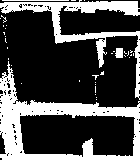

# 2022 REU on Smart UAVs
Auburn University 2022 REU on Smart UAVs

# The Project

###### Alec Pugh & Luke Bower

### 3D UAV Path Planning using Aerial/Incomplete Point Clouds

  
  

_add stuff about the process_

#

use a conversion of lidar distance to unit of measure and possibly use that for both distance travled and controling the direction of the drone.

(for the begingih phaese)Use Open Topgraph website to get lidar scan for given region of gps then download a laz or las file(ultmatly we want to be able to insert a set of corrdnates it then run the scan, covert the file, read in the data, run the checks and path finder, send it to the drone then that drone follow the path and exicute any commands needed at specific points)(laz will have to be unziped to be a las) that is then converted to a notpad(that will be read in from program setting the x, y and z variables by using their conversion factors of a spherical corridnate system) with the data set for x,y and z corridnates that can then be used in something like an if check to find out what heights have the most frequent occurence to then compair the path of least resistance. The x and y will be evaluaed based on the FAA* algorithems top lets say 3 paths to then create an evaluation of the paths that is formed from a binary conversion of the data to find where the obstructions will be. Once that path is created they will be sent to the drone in a step by step method by the use of waypoints along the way to trace the most efficent path (this will be achived by either gps siginals or by the use of conversion of speed and distance to get the time of flight for each step). 

store las coridnates with the grided x-y equlivant then after computing shortest path use the look up table to find the las x-y assoitation with grid x-y and convert the coridnates.

create a return path if needed(so save previous waypoints along the travled path)

Use OpenTopogrphy api to insert data/cordinates.

to create a variabled hight evauation reestablish a fastest path at every difrent frame of height to then work to create diagnal lines between motion.

The map coridnate system is wgs84 web mercator [epsg: 3857] and can be converted to and from lats and longs. *all values are in meters*
The height is based on NAVD88 is referenced to the Mean Sea Level at one tide station located at Father Point in Rimouski, Quebec.
For z coridnates it is meters off of sea level just find the ground point and subtract it from all others and tehn you have teh meter height.
