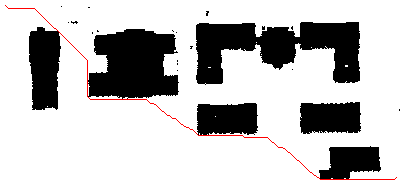

# 2022 REU on Smart UAVs
Auburn University 2022 REU on Smart UAVs

# The Project

###### Alec Pugh & Luke Bower

### 3D UAV Path Planning using Aerial/Incomplete Point Clouds

  
  

### General Process

* Download a point cloud in .las format from OpenTopography.
* Convert .las to a gridded DEM image of 1m per pixel.
* Run A* on every height layer to generate the optimal flight path for each crossection.
* Add buffer to obstacles using BFS to account for drone size. (or another way to smooth the line)
##### Todo
* Simulate UAV moving through path by updating start node each frame.
* Check each height layer (above/below current position + forward depending on how long it would take to reach that height) for shorter paths. If shorter, move drone to that position.
* Convert pixel position to GPS way point and send this information to UAV.
* Finish API integration to further automate the process.

#
